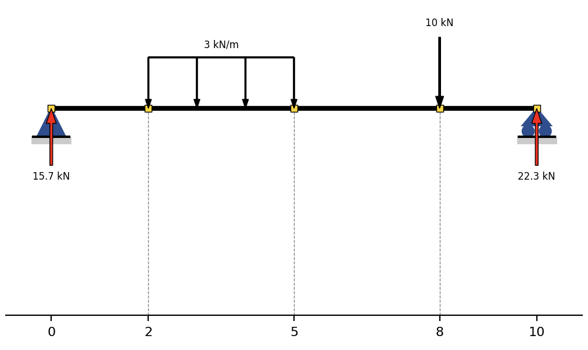

# Información sobre el código

`Beam.tramos()`

Devuelve 4 listas (tramosX, tramosX_ex, tramos, x, x_ex) 
Ejemplo:

 

+ **tramosX**: lista con listas de los valores enteros de x de cada tramo (de nodo a nodo). Para este ejmplo: tramosX = [[0, 1, 2], [2, 3, 4, 5], [5, 6, 7, 8], [8, 9, 10]]

+ **tramosX_ex**: lista con listas de los valores de x de cada tramo pero cada tramo es dividido en 100 valores. Para este ejmplo: tramosX_ex = [[0, 0.02, ... , 1.97, 2], [2, 2.03, ... , 4.96, 5], ... , [8, 8.02, ... , 9.97, 10]] (tramosX_ex es un numpy array)

+ **tramos**: lista con listas de la longitud de cada elemento partiendo en 0. Para este ejmplo: tramos = [[0, 1, 2], [0, 1, 2, 3], [0, 1, 2, 3], [0, 1, 2]]

+ **x**: lista con los valores enteros del eje x (tramosX unificado en una lista). El valor de x de los nodos está duplicado. Para este ejmplo: x = [0, 1, 2, 2, 3, 4, 5, 5, 6, 7, 8, 8, 9, 10]

+ **x_ex**: lista con los valores del eje x, con el intervalo de cada elemento dividido en 100 valores (tramosX_ex unificado en una lista). El valor de x de los nodos está duplicado. Para este ejmplo: x_ex = [0, 0.02, ... , 9.97, 10]